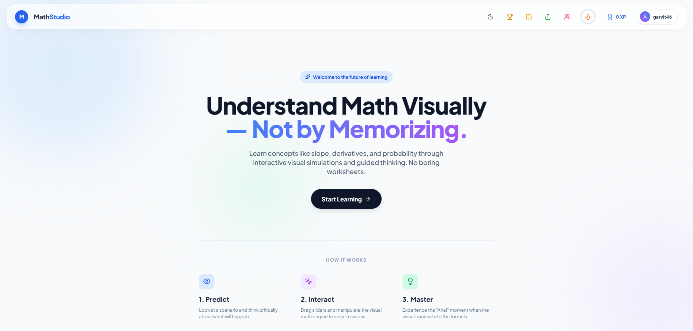
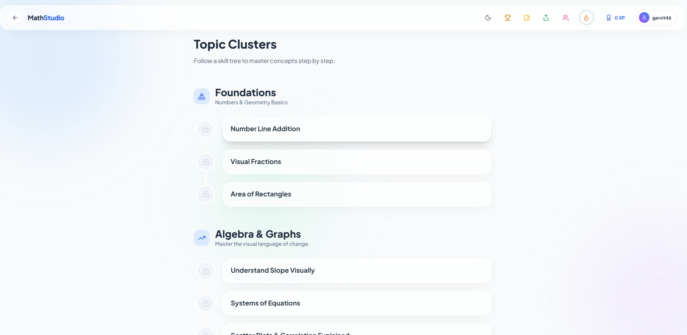
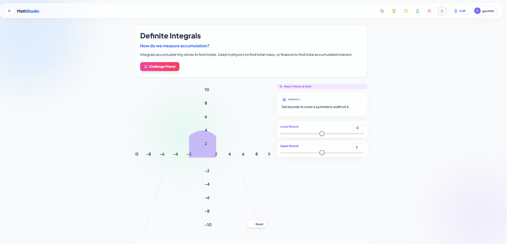

# MathStudio

**Understand Math Visually — Not by Memorizing.**

MathStudio is a modern web-based **visual math lab** that uses interactive simulations, missions, and gamification to make abstract math concepts like slope, derivatives, integrals, and probability clear and engaging. It moves away from traditional, worksheet-based learning to an active, "predict-interact-master" model.



## Core Features

### Interactive Visual Simulations
Learn concepts like slope, derivatives, and probability by directly interacting with the visual math engine. Drag sliders, manipulate graphs, and see formulas come to life. No boring worksheets.

### The "Predict, Interact, Master" Learning Cycle

The platform is organized around a three-step learning cycle for deeper understanding:

1.  **Predict:** Look at a scenario and think critically about what will happen.
2.  **Interact:** Drag sliders and manipulate the visual math engine to solve missions.
3.  **Master:** Experience the "Aha!" moment when the visual connects to the formula.

### Topic Clusters & Skill Trees

Master concepts step by step with organized topic clusters:
- **Foundations:** Numbers & Geometry Basics
    - Number Line Addition
    - Visual Fractions
    - Area of Rectangles
- **Algebra & Graphs:** Master the visual language of change.
    - Understand Slope Visually
    - Systems of Equations
- **Calculus:** *(As seen in the Definite Integrals module)*
    - Definite Integrals



### Interactive Missions with Real-Time Feedback

Engage with hands-on missions, like the Definite Integrals module, which allows you to:
- **Explore:** Understand integration as the accumulation of tiny slices to find totals, with real-world applications in physics and finance.
- **Solve:** Interact with a live graph, moving bounds to solve a mission.
- **Collaborate:** Use the "Challenge Friend" feature to make learning social.



### Gamified Learning & Engagement

Stay motivated with built-in gamification features, including a "Diamond League" tier system and a daily streak tracker to reward consistent learning.


## Tech Stack

- **Frontend Framework:** React 18
- **Language:** TypeScript (Strict Mode)
- **Build Tool:** Vite
- **Styling:** Pure CSS / CSS Modules
- **Deployment:** Vercel

## 🚀 Getting Started (Local Development)

Clone the repository:

```bash
git clone https://github.com/your-username/mathstudio.git
cd mathstudio
```

### ⚖️ Legal Disclaimer
This platform is an independent educational project. While we strive for accuracy in all mathematical content, users are encouraged to verify critical concepts through additional trusted sources.
